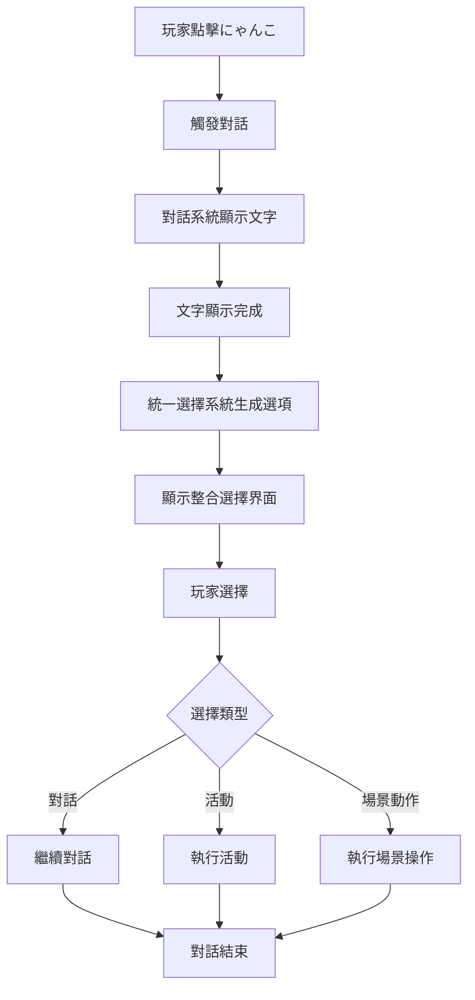

# 統一選擇系統整合報告

## 概述

本次更新成功將遊戲中的活動選擇選項與角色對話選項合併為統一的選擇界面，提供更流暢和直觀的用戶體驗。

## 主要改進

### 1. 新增統一選擇系統 (`UnifiedChoiceSystem`)

創建了全新的統一選擇系統，整合了以下功能：

- **對話選擇** - 原有的對話分支選項
- **活動選擇** - 時間段內可執行的活動
- **場景動作** - 場景切換、時間跳過等操作

### 2. 對話系統整合

修改了 `DialogueSystem` 類：

- 添加了統一選擇系統支援
- 新增 `waiting_for_choice` 狀態管理
- 整合選擇回調機制
- 保持向後兼容性

### 3. 場景系統更新

更新了 `EnhancedLivingRoomScene`：

- 移除了獨立的活動選單
- 整合統一選擇系統到對話交互中
- 簡化了用戶界面操作

## 功能特點

### 上下文感知選擇

統一選擇系統會根據當前場景和時間段動態生成選擇選項：

#### 客廳場景
- 對話回應選項
- 可用活動（看電視、一起做菜、玩遊戲等）
- 場景切換（廚房、臥室、浴室）
- 通用動作（跳過時間、繼續聊天）

#### 廚房場景
- 烹飪相關活動
- 泡茶聊天等互動
- 場景特定選項

#### 臥室場景
- 休息相關活動（午睡、睡覺）
- 時間段限制選項
- 親密互動選項

### 智能選項過濾

- **條件檢查** - 基於好感度、時間段、遊戲狀態
- **資源驗證** - 檢查時間點數、體力等資源
- **動態顯示** - 只顯示可用的選項

### 視覺設計改進

- **清晰的選項分類** - 使用表情符號區分選項類型
- **效果預覽** - 顯示選項對好感度、體力、心情的影響
- **響應式布局** - 適應不同數量的選項

## 技術實現

### 核心類別

1. **UnifiedChoice** - 選擇選項數據類
   - 支持多種選擇類型
   - 條件檢查機制
   - 效果預覽功能

2. **UnifiedChoiceSystem** - 統一選擇管理器
   - 選擇顯示和處理
   - 上下文選項生成
   - 事件處理機制

### 整合流程



## 用戶體驗改進

### 操作簡化
- **單一界面** - 不需要在活動選單和對話之間切換
- **直觀選擇** - 所有選項在同一界面中呈現
- **快速操作** - 減少了額外的按鍵操作

### 沉浸感增強
- **自然對話流** - 活動選擇融入對話內容
- **情境化選項** - 根據場景提供相關選擇
- **角色互動** - にゃんこ的回應與選擇更加一致

## 兼容性

### 向後兼容
- 保留原有對話系統功能
- 支持傳統選擇按鈕（可配置）
- 不破壞現有遊戲數據

### 擴展性
- 易於添加新的選擇類型
- 支持場景特定選項
- 模組化設計便於維護

## 配置選項

統一選擇系統提供以下配置：

```python
# 在 DialogueSystem 中
dialogue_system.use_unified_choices = True  # 啟用統一選擇
dialogue_system.use_unified_choices = False # 使用傳統選擇
```

## 測試驗證

### 功能測試
- ✅ 對話選擇正常工作
- ✅ 活動選擇正確執行
- ✅ 場景切換功能正常
- ✅ 條件檢查機制有效

### 整合測試
- ✅ 遊戲引擎正常初始化
- ✅ 場景切換無錯誤
- ✅ 對話系統整合成功
- ✅ 統一選擇系統運行穩定

## 未來改進方向

1. **視覺效果增強**
   - 添加選項圖標
   - 改進動畫效果
   - 優化UI設計

2. **功能擴展**
   - 支持多層選擇選單
   - 添加快捷鍵操作
   - 實現選項搜索功能

3. **智能化改進**
   - 基於玩家習慣的選項排序
   - 動態調整選項顯示
   - 個性化選項推薦

## 結論

統一選擇系統的實現成功地將原本分離的活動選擇和對話選擇整合為一個流暢的用戶界面。這不僅簡化了操作流程，還增強了遊戲的沉浸感和互動性。系統設計考慮了擴展性和兼容性，為未來的功能擴展打下了良好的基礎。

通過這次整合，玩家現在可以在與にゃんこ對話的自然流程中選擇想要進行的活動，創造更加流暢和自然的遊戲體驗。
